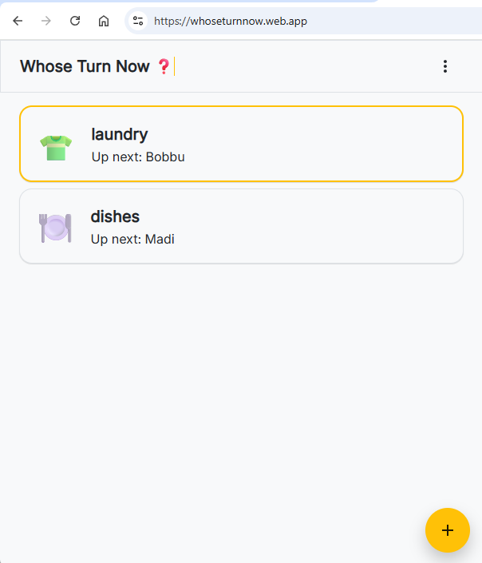
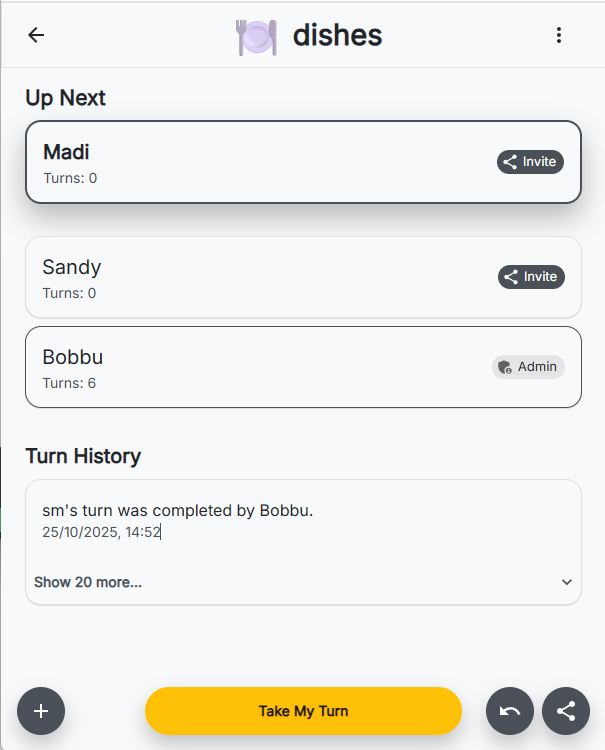

# Whose Turn Now

---

A lightweight, real-time, open-source utility for tracking whose turn it is. Manage your turn-based lists as easily and intuitively as a WhatsApp group.

**Live Demo:** [whoseturnnow.web.app](https://whoseturnnow.web.app)

*The main dashboard showing all your lists, with a highlight for lists where it's your turn.*

*The interactive list view with the "Up Next" participant, action buttons, and transparent turn history.*

## The Philosophy

"Whose Turn Now" is designed to solve a simple, recurring social problem with a clean, transparent, and forgiving interface. The core principle is that the turn-tracking list should be a **dynamic queue**, not a static rotation. The application is built on an immutable, auditable log, ensuring every action is recorded and verifiable.

## Core Features

*   **⚡️ Instant Anonymous Use:** Start using the app instantly without an account. Your lists are saved to your session, and you can create a permanent account later to save them forever.
*   **🔄 Dynamic Turn Queue:** The person at the top of the list is always next. When a turn is completed, they move to the bottom. Simple, visual, and intuitive.
*   **⏭️ Skip Your Turn:** If it's your turn, you can choose to skip, moving you to the end of the queue without incrementing your turn count.
*   **👥 Managed Participants:** Keep track of turns for anyone, even if they don't have the app. Perfect for managing kids' chores, pets, or friends who aren't online.
*   **🤝 "Council of Admins" Management:** All admins have equal power to manage a list, add participants, and promote other admins. There's no single "owner" bottleneck.
*   **↩️ Three-Turn Undo Stack:** Accidentally completed a turn? No problem. The app allows you to undo the last three valid turns. Every undo is a transparent, logged action that reverts the state.
*   **📜 Immutable Turn History:** Every action—completing a turn, skipping, resetting counts, or undoing—is recorded in a permanent, timestamped log for full transparency.
*   **🎨 Personalized Lists:** Give your lists personality with a selectable emoji icon.
*   **🔗 Invite via Link:** Easily invite friends to join your list with a simple, shareable URL.

## Tech Stack

*   **Framework:** [React](https://reactjs.org/) with [Vite](https://vitejs.dev/)
*   **Language:** [TypeScript](https://www.typescriptlang.org/)
*   **Backend & Database:** [Firebase](https://firebase.google.com/) (Authentication & Firestore)
*   **State Management:** [Zustand](https://github.com/pmndrs/zustand)
*   **UI:** [Material-UI](https://mui.com/)
*   **Package Manager:** [pnpm](https://pnpm.io/) (within a monorepo)

## Getting Started

To run this project locally, follow these steps from the repository root:

**1. Clone the rep